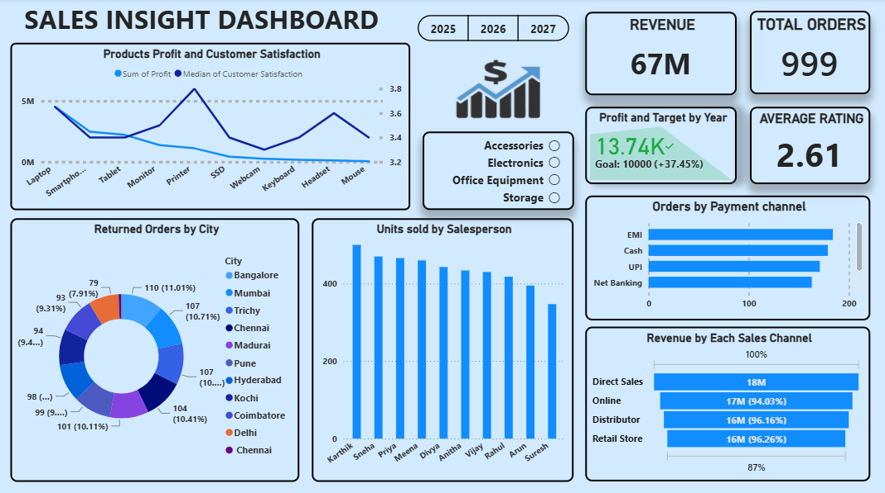

# 📊 Sales Insight Dashboard

An interactive sales analytics dashboard built on a practice electronics/office-supplies sales dataset, covering **2025–2027**. It tracks revenue, profit, orders, returns, and customer satisfaction across products, cities, salespeople, payment channels, and sales channels — helping visualize performance and trends at a glance.

---

## Overview

This dashboard answers key business questions such as:

- Which products drive the most profit, and how does that align with customer satisfaction?
- Which cities generate the most returned orders?
- Which salespeople are selling the most units?
- How are orders split across payment channels (EMI, Cash, UPI, Net Banking, Credit Card, Debit Card)?
- How does revenue break down across sales channels (Direct Sales, Online, Distributor, Retail Store)?
- Is the business tracking against its profit target?

**Filters available:** Year (2025 / 2026 / 2027), Category (Accessories, Electronics, Office Equipment, Storage).

---

## Key Metrics (KPIs)

| Metric | Value |
|---|---|
| Revenue | 67M (₹67,889,726 across all orders) |
| Total Orders | 999* |
| Total Profit | ₹12.9M |
| Average Rating | ~2.6–3.0 (varies by filter; ~40% of orders have no rating) |

\* The raw CSV has 1,008 rows but only 1,000 unique Order IDs (8 duplicates) — the dashboard's 999 total-orders figure reflects de-duplication.

---

## Visuals Included

- **Products Profit and Customer Satisfaction** — dual-line chart comparing sum of profit against median customer satisfaction across products (Laptop, Smartphone, Tablet, Monitor, Printer, SSD, Webcam, Keyboard, Headset, Mouse)
- **Returned Orders by City** — donut chart showing return volume by city (Bangalore, Mumbai, Trichy, Chennai, Madurai, Pune, Hyderabad, Kochi, Coimbatore, Delhi)
- **Units Sold by Salesperson** — bar chart ranking the 10 salespeople (Karthik, Sneha, Priya, Meena, Divya, Anitha, Vijay, Rahul, Arun, Suresh) by units sold
- **Orders by Payment Channel** — horizontal bar chart comparing EMI, Cash, UPI, Net Banking, Credit Card, and Debit Card order volumes
- **Revenue by Each Sales Channel** — horizontal bar chart of Direct Sales, Online, Distributor, and Retail Store revenue, shown against a 100% target line
- **Profit and Target by Year** — goal-tracking card showing profit achieved vs. target

---

## Dataset Structure

The dataset (`PRACTICE_DATASET_Sales_Data_.csv`) is a single flat transaction table — one row per order.

### `sales_data` (1,008 rows)
| Column | Description |
|---|---|
| Order ID | Unique order identifier (e.g. `ORD10001`) — 8 duplicate IDs present |
| OrderDate | Order date, `DD/MM/YYYY` (spans 2025–2027) |
| Gender | Male / Female / Other — inconsistent casing in raw data (`M`, `male`, `female`) |
| Phone | Customer phone number — a few blanks |
| City | Order city — has inconsistent casing/whitespace and one mismatched state pairing to clean (`CHENNAI`, ` CHENNAI `, `chennai`, `Bengaluru` vs `Bangalore`) |
| State | Customer's state |
| Product | Laptop, Smartphone, Tablet, Monitor, Printer, SSD, Webcam, Keyboard, Headset, Mouse |
| Category | Electronics / Accessories / Storage / Office Equipment |
| Customer Segment | Enterprise / Corporate / Small Business / Consumer — some inconsistent casing (`Small business`, `SMB`) |
| Sales Channel | Online / Retail Store / Distributor / Direct Sales |
| Quantity | Units ordered — some blanks (~15 rows) |
| Unit Price | Price per unit |
| Discount | Discount % applied |
| Revenue | Order revenue — a few blanks |
| Cost | Order cost |
| Profit | Revenue minus cost (a handful of rows are negative) |
| Payment | UPI / Cash / EMI / Credit Card / Debit Card / Net Banking |
| Salesperson | One of 10 salespeople |
| Order Status | Pending / Completed / Returned / Cancelled — inconsistent casing in raw data |
| Customer Rating | 1–5 — roughly 20% of rows have no rating |
| Delivery Days | Days to deliver |
| Returned | Yes / No |
| Customer Satisfaction | 1–5 satisfaction score |

---

## Data Quality Notes

Since this is a practice dataset, a few cleaning steps are worth applying before/within the BI tool:
- **Standardize text casing** for Gender, City, Customer Segment, and Order Status (mixed case and abbreviations appear throughout).
- **Trim whitespace** in City (e.g. `" CHENNAI "`).
- **Reconcile city/state mismatches** — a handful of rows pair a Tamil Nadu city with `Karnataka`, or list `Bengaluru` separately from `Bangalore`.
- **De-duplicate Order ID** — 8 IDs appear twice.
- **Handle nulls** in Quantity, Revenue, Customer Rating, and Phone rather than treating blanks as zero.

---

## Tools Used

- **Data source:** `PRACTICE_DATASET_Sales_Data_.csv`
- **Dashboard/Visualization:** Power BI (or your preferred BI tool)

---

## How to Use

1. Clone this repository.
2. Open `PRACTICE_DATASET_Sales_Data_.csv` to explore the raw data.
3. Clean the data per the notes above (or apply equivalent Power Query steps).
4. Open the dashboard file in Power BI / your BI tool of choice.
5. Use the filters (Year, Category) to explore the data interactively.

---

## Insights at a Glance

- **Electronics** is the largest category by order count (413 orders), followed by Accessories (383), Office Equipment (113), and Storage (99).
- **Direct Sales** is the top sales channel by order count (269), with Retail Store, Online, and Distributor fairly close behind.
- **EMI** and **Cash** are the most-used payment methods, though all six payment types are fairly evenly represented.
- Returns are common — **487 of 1,008 orders (~48%)** are marked as returned, a good candidate for a root-cause deep-dive by product/city.
- Average customer rating sits around **3.0** on the ~800 rows that have one, notably lower than order and revenue performance — worth digging into as a follow-up.

---

## License

This project uses a sample/synthetic sales dataset for educational and portfolio purposes.
